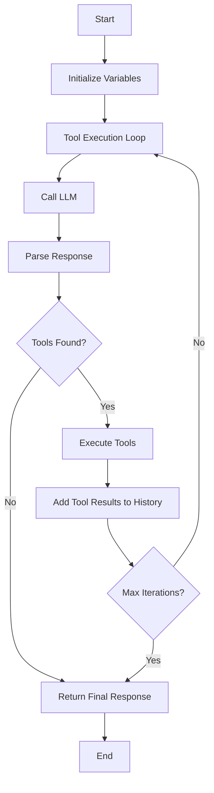

# OpenAIService Documentation

## Overview

The `OpenAIService` class is a comprehensive service for handling AI-powered conversations with tool calling capabilities. It provides streaming chat functionality and integrates with various tools like calendar management through the Model Context Protocol (MCP).

## Architecture

```
┌─────────────────┐    ┌──────────────────┐    ┌─────────────────┐
│   ChatView      │────│  OpenAIService   │────│  CalendarMCP    │
└─────────────────┘    └──────────────────┘    └─────────────────┘
                                │
                                │
                         ┌──────────────┐
                         │  OpenAI API  │
                         └──────────────┘
```

## Properties

### Private Properties

| Property | Type | Description |
|----------|------|-------------|
| `apiKey` | `String` | Authentication key for OpenAI API access |
| `baseURL` | `String` | Base URL for the API endpoint (supports custom endpoints) |
| `calendarMCP` | `CalendarMCP` | Calendar tool integration using Model Context Protocol |

## Methods

### Initialization

#### `init(apiKey: String, customBaseURL: String? = nil)`

Initializes the OpenAI service with authentication and endpoint configuration.

**Parameters:**
- `apiKey`: Required authentication key
- `customBaseURL`: Optional custom API endpoint (defaults to OpenAI's official endpoint)

**Processing Flow:**
1. Store the API key
2. Configure base URL (remove trailing slash if present)
3. Set default to `https://api.openai.com` if no custom URL provided
4. Initialize calendar MCP instance

### Core Chat Functionality

#### `sendChatMessage(_ message: String, conversationHistory: [ChatMessage]) -> AsyncThrowingStream<String, Error>`

Basic streaming chat functionality without tool calling capabilities.

**Parameters:**
- `message`: User input message
- `conversationHistory`: Array of previous conversation messages

**Returns:** Async stream of response chunks

**Processing Flow:**
1. Build request payload with system message and conversation history
2. Configure HTTP request with streaming headers
3. Send request to `/v1/chat/completions` endpoint
4. Parse streaming response chunks
5. Yield content pieces as they arrive
6. Handle completion and errors

### Enhanced Chat with Tools

#### `sendChatMessageWithTools(conversationHistory: [ChatMessage]) -> AsyncThrowingStream<(String, String), Error>`

Advanced chat functionality with tool calling capabilities and multi-turn conversations.

**Parameters:**
- `conversationHistory`: Complete conversation history including user message

**Returns:** Async stream of tuples containing status type and content

**Processing Flow:**



**Detailed Steps:**

1. **Initialization**
   - Set up conversation history
   - Initialize tool execution counter
   - Set maximum iterations limit (3)

2. **LLM Interaction Loop**
   - Send empty message with full conversation history
   - Stream response chunks
   - Emit status updates to UI

3. **Tool Call Detection**
   - Parse response for JSON tool calls
   - Extract tool name and arguments
   - Clean response text from tool calls

4. **Tool Execution**
   - Execute each detected tool
   - Collect tool results
   - Emit tool status updates

5. **History Management**
   - Add LLM response to conversation
   - Add tool results as system messages
   - Continue loop if more tools needed

6. **Completion**
   - Finalize when no tools found
   - Handle maximum iteration limit

### Tool Processing

#### `extractToolCalls(from response: String) -> ([ToolCall], String)`

Parses LLM responses to extract tool calling instructions.

**Processing Flow:**
1. Try parsing entire response as JSON
2. Use regex to find JSON objects with balanced braces
3. Validate JSON contains required `tool` and `arguments` fields
4. Remove extracted tool calls from response text
5. Return array of tool calls and cleaned text

#### `executeTool(_ toolCall: ToolCall) async throws -> [String: Any]`

Executes individual tool calls through the appropriate service.

**Supported Tools:**
- `read-calendar`: Retrieve calendar events
- `update-calendar`: Modify calendar entries

### System Message Generation

#### `generateSystemMessage() -> String`

Creates the system prompt that defines the AI's capabilities and behavior.

**Components:**
- Tool descriptions from CalendarMCP
- Current date context
- JSON response format instructions
- Response transformation guidelines

## Data Models

### Core Models

#### `ChatMessage`
Represents a single conversation message with metadata.

#### `ToolCall`
Encapsulates tool calling information:
- `tool`: Tool identifier
- `arguments`: Tool parameters as dictionary

### Response Models

#### `ChatStreamResponse`
- `choices`: Array of response choices
- `StreamChoice`: Individual choice with delta content
- `StreamDelta`: Content piece in streaming response

### Error Handling

#### `OpenAIError`
Custom error types:
- `invalidResponse`: API response parsing failed
- `noAudioData`: Missing or empty audio data
- `transcriptionFailed`: Speech-to-text processing failed
- `htmlErrorResponse`: HTML error page received
- `customError(String)`: Custom error with message

## Status Types

The service emits various status types through the streaming interface:

| Status Type | Description |
|-------------|-------------|
| `status` | General processing status |
| `tool_call` | Tool invocation initiated |
| `tool_arguments` | Tool parameters being used |
| `tool_execution` | Tool execution in progress |
| `tool_results` | Tool execution results |
| `response` | AI response content |
| `error` | Error occurred during processing |

## Configuration

### API Model
The service is configured to use `deepseek/deepseek-chat-v3-0324` model with:
- Temperature: 0.7
- Streaming enabled
- Tool calling support

### Request Timeout
- Standard requests: 60 seconds
- Resource timeout: 120 seconds
- Keep-alive connections enabled

## Integration Points

### Calendar MCP Integration
- Seamless calendar operations through MCP protocol
- Tool descriptions automatically included in system messages
- Async tool execution with proper error handling

### UI Integration
- Real-time status updates through streaming interface
- Workflow step tracking for user feedback
- Error state management and user notifications

## Best Practices

1. **Error Handling**: Always wrap service calls in try-catch blocks
2. **Memory Management**: Conversation history is limited to recent 10 messages
3. **Tool Limits**: Maximum 3 tool execution cycles prevent infinite loops
4. **Status Updates**: Provide real-time feedback through status emissions
5. **Async Operations**: Use proper async/await patterns for all network calls
