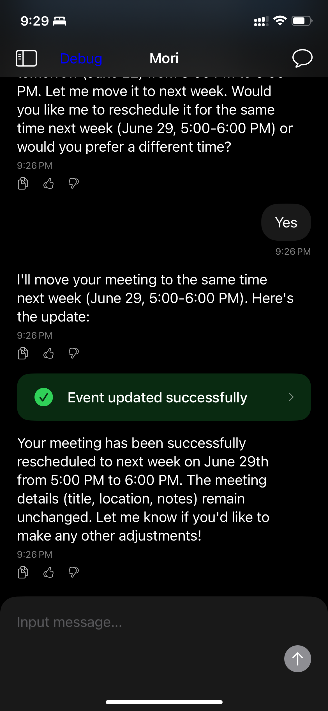

    

<h1 align="center"> Mori </h1>

<h4 align="center">
    A privacy-first AI Agent app on iOS with voice chat capabilities.
</h4>

## Showcases

### Just say the word to update your calendar events.

| Screenshot1 | Screenshot2 |
| -------------------------------------- | -------------------------------------- |
|    |  |

## What Mori can do

- Read your calendar events
- Create, update, and delete calendar events
- Move calendar events to different times
- Search for calendar events

## ❓ FAQ

### Q: How does this project make money?  

A: The app itself is open-source and free to use locally. Revenue comes from premium services and API access.

## 📄 License

This project is licensed under the MIT License. See [LICENSE.md](LICENSE.md) for details.

## 🤝 Contributing

Issues and Pull Requests are welcome to improve this project!

