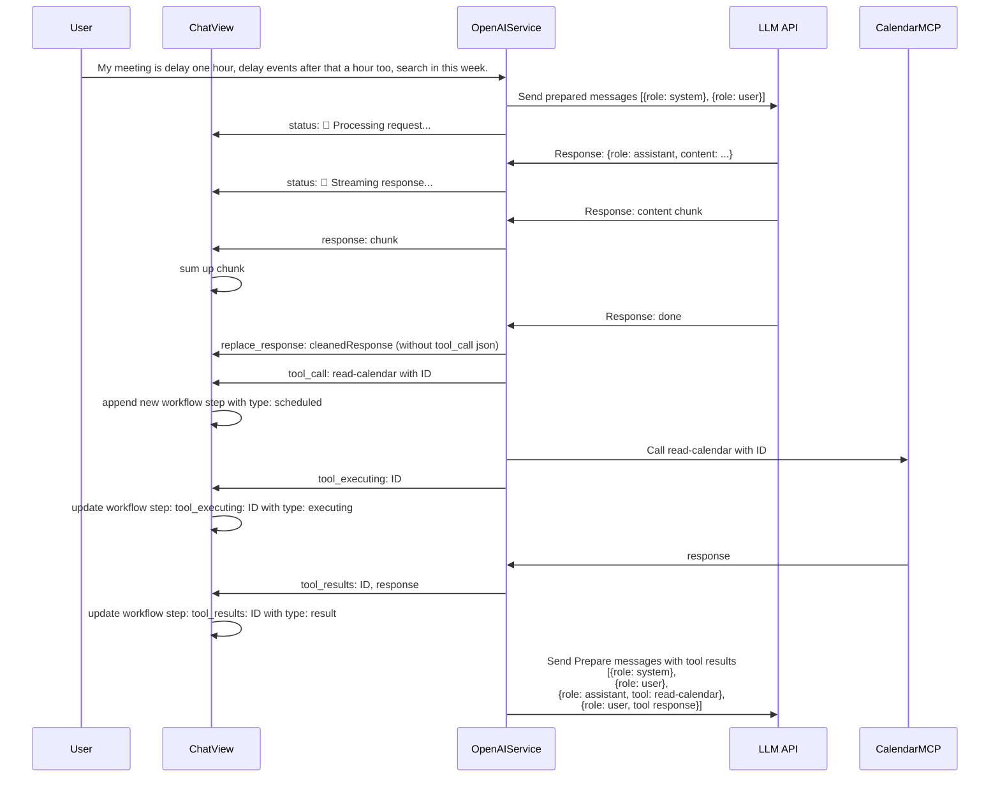

## Data Structure
- messageList: [ChatMessage | WorkflowStep]
- currentStatus: String

### ChatMessage
- id: UUID
- content: String
- isUser: Bool
- timestamp: Date
- isSystem: Bool

### WorkflowStep
- id: UUID
- type: WorkflowStepType
- title: String // name of tool
- details: [String: Any]
- timestamp: Date

### WorkflowStepType
- scheduled
- executing
- result
- error

## Flow

## Data Mapping
### ChatMessage in ChatView
Display as MessageView
### ChatMessage in OpenAIService
make ChatMessage to {
  role: "system" | "user" | "assistant"
  content: String
}

### WorkflowStep in ChatView
Display as WorkflowStepView
### WorkflowStep in OpenAIService
make WorkflowStep to {
  role: "user"
  content: String // which is detail of step
}